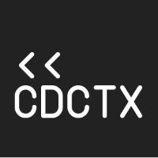

# codecontext.io ZeusShieldCoin Token Sale Code Review

## 1. Introduction
This document summarizes our best effort to review the provided source code of the ZeusShieldCoin Token & the Token Sale solidity smart contracts. We reviewed the following contracts:

- `multisigtoken.sol` with sha256 `3c33fe4d033e2640c36aff932855545f0c9586422a77641099b2fda6ad9a0518`
- `multisigwallet.sol` with sha256 `cba228f76ac474ac69956fc5fbfdaa785ce0c840bf78a475eeb278baf690a245`
- `icofactory.sol` with sha256 `c27f23fc431183c9d800c74fc9fbafaa442cd4a311088dbe7d2deaee1a3d2481`
- `token.sol` with sha256 `05dca4934a0dab4724a6f10b3a52b14969cb5c66d6e52b7e349854d19cfc317a`

## 2. About this review
This is a source code security audit where only code and security considerations have been annotated. We have not reviewed:

- The functional design of the contracts;
- The design, deployment, operation and contingency plan of the ICO;
- The EVM code generated;
- The credibility or profitability of the team, idea, or any investment in general. 

**Critically analyse the provided information**: Code reviews are hard, and some of the analysis provided in this code review could be erroneous or come from a misinterpretation of the operations done in these smart contracts.

**This review is an opportunity to re-read the code**: Instead of checking only the points proposed, consider re-reading all the code to find additional issues.

**Bug bounties and multiple security reviews are a must**: Code reviews are not enough to ensure the safety of a smart contract. A public bug bounty is essential, as it gives the community at large a chance to participate in reviewing the overall security of the code. A great example is the Aragon Bug Bounty Program.

## 3. Review results
### 3.1. General considerations
In general, the code follows all the security measures and best practices expected when writing solidity smart contracts that will hold user funds:

- Written by skilled developers with strong knowledge of the Ethereum security domain
- Safe coding patterns
- Easy to read, well commented source code in general
 
### 3.2. Critical problems

- `ZeusShieldCoin.approve` is vulnerable to a frontrunning attack as described in https://github.com/ethereum/EIPs/issues/20#issuecomment-263524729,  see mitigation implementation in MinimiToken or in OpenZeppelin .
- `ZeusShieldCoin.freeze` can be called by the contract owner to freeze token transfers of non-team addresses for the first 24 months.

See https://github.com/Giveth/minime/blob/2b61f1c0faf4401140abad3f0639733f3142b65e/contracts/MiniMeToken.sol#L263

See https://github.com/OpenZeppelin/zeppelin-solidity/blob/209e2de93be06110bc7133b46f25a773d0a4c427/contracts/token/StandardToken.sol#L52 


### 3.3. Potential problems
- It’s a common practice in ICOs that the issued tokens are not transferrable until the ICO ends, please check if you want to allow it.
- Consider defining `ZSCCrowdsale.mPriceDiscounted` and `ZSCCrowdsale.mPriceNormal` as public, to allow you to check if these variables are correctly set before starting the sale.
- No overflows have been found, nonetheless, we strongly recommend using SafeMath libraries to prevent overflows.
- No tests are provided, and the complexity of the code is enough to require proper automated functionality checks. Truffle framework (http://truffleframework.com/) provides a comprehensive set of tools to create unit tests.

See https://github.com/OpenZeppelin/zeppelin-solidity/blob/209e2de93be06110bc7133b46f25a773d0a4c427/contracts/math/SafeMath.sol

### 3.3. Warnings

- The required solidity version is quite old; specify  a newer version of the compiler via `pragma solidity ^0.4.15`.
- In `ZeusShieldCoin.registerSale` `_tokenFactory` and `_congressAddress` parameters are not checked, consider verifying that they are not zero-valued.
- We recommend adding more event logging. Events are really useful to aid in future troubleshooting.
- The contract allows having multiple `ZSCCrowdsale` phases opened at the same time and the number of tokens for sale during the sale can be set with `setTokensForSale().` We assume that this is part of the normal ICO operation.

### 3.4. Comments

- There’s a removal of methods of ConsenSys MultiSigWallet, in `multisigtoken.sol` and `multisigwallet.sol`. In general, it is better just to override these methods and keep the original contract intact.
- `ZSCMultiSigToken.executeTransaction` override does not match with the function declaration, since it only transfers tokens. The same functionality could be achieved without this non-conformant overriding. The basic idea is to generate a helper function to initially register the multisig token transfer transaction; this can be done by defining a function with exactly the same signature and then using the `msg.data` that contains the marshalled data. Later additional standard `confirmTransaction` calls could be done to authorise the transfer.

```
contract ZSCMultiSigToken is MultiSigWallet {
    token public tokenFactory ;

    function ZSCMultiSigToken(address[] _owners, uint _required, token _addressOfTokenFactory)
        public
        MultiSigWallet( _owners, _required)
    {    
        tokenFactory = token(_addressOfTokenFactory);
    }
    function transfer(address _receiver, uint _amount) {
        submitTransaction(tokenFactory,0,msg.data);
    }
}
```

- Some variables could be constant like `ZSCCrowdsale.amountTokenMinimal`
- Some variables with contents that are not representing ethers are using the `ether` suffix, like `ZSCCrowdsale.amountTokenMinimal`. Consider using 10 ** 18 instead.
- `uint` values (like `msg.value`) cannot be negative, those checks about negative values can be avoided.
- To explicitly prevent receiving money via the fallback function, better use `function() payable { throw; }` with the `payable` modifier.
- Better use `assert`/`require`/`revert` instead of `throw`.
- Function `ERC20Interface.totalSupply()` is commented out.

## 4. Conclusion

The reviewed smart contracts are well crafted. They follow the expected common security practices for safe smart contract development. Two critical problems and other potential ones should be addressed. We do not recommend to launch the ICO without passing a full set of unit tests due to the complexity of the smartcontracts.

